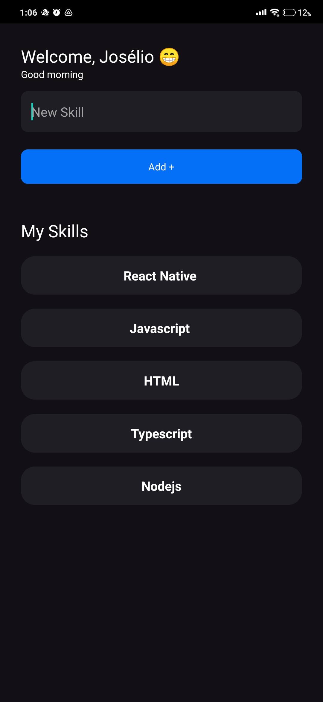

<!-- PROJECT LOGO -->
 

  

  <h3 align="center">My Skills</h3>

  

    🔧 Finalizado 🔧
     
    App construído com React Native durante o Ignite da Rocketseat.
     
     
    <a href="https://exp-shell-app-assets.s3.us-west-1.amazonaws.com/android/%40joseliot/myskills-1f9513d8bb134f52a3f78be29957295a-signed.apk"><strong>Baixar »</strong></a>
     
     
    <a href="https://exp-shell-app-assets.s3.us-west-1.amazonaws.com/android/%40joseliot/myskills-1f9513d8bb134f52a3f78be29957295a-signed.apk">Baixar o APK</a>
    ·
    <a href="https://github.com/joseliosamy/my-skills/issues/new">Reportar Bug</a>
    ·
    <a href="https://github.com/joseliosamy/my-skills/issues/new">Pedir Melhoria</a>
  

